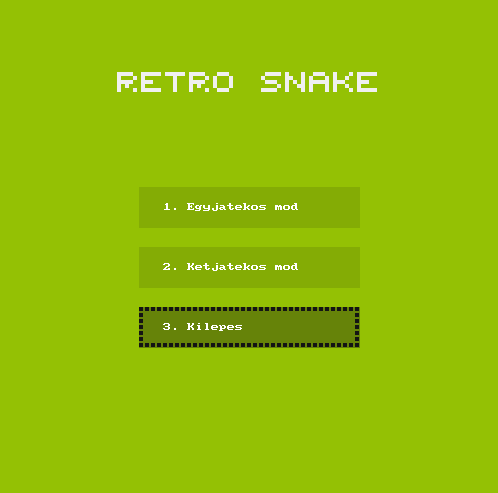
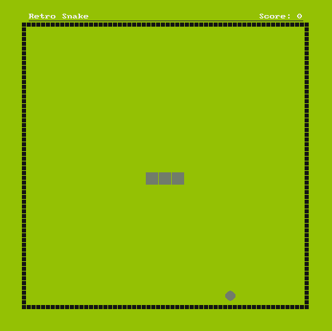
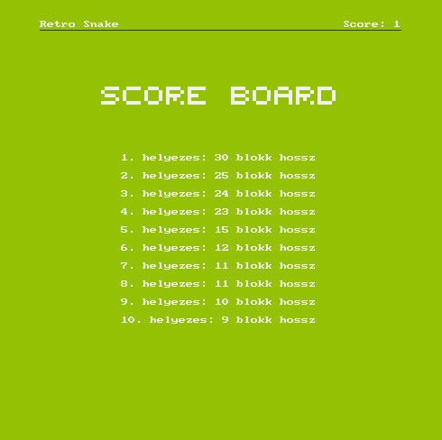

# Snake Game

A semi-modular 2D Snake game written in C11 using SDL2, featuring retro pixel-art visuals, and persistent high-score tracking.

## Dependencies

- `C Compiler:` GCC or Clang (with C11 standard support)

- `Build System:` CMake (v3.16+) & Ninja (or Make)

- `Graphics Libraries:`

    - SDL2

    - SDL2_gfx

## Pictures

## Technical Skills & Concepts Demonstrated

- **Data Structures & Algorithms:** 
    Linked Lists (snake body logic) and 
    Bubble Sort (leaderboard score ranking).
- **Memory Management:** 
    Manual dynamic allocation (`malloc`/`free`), pointer manipulation. 
    Memory leak tracing via `debugmalloc` (debugmalloc.h is not uploaded because it is not created by me but i tested the game with it and there is no memory leak.).
- **Graphics & UI:** 
    Basic 2D graphical UI with SDL2/SDL2_gfx .
- **Architecture:** 
    Modular C11 structure and cross-platform CMake builds.
- **System & File I/O:** 
    Standard C file stream handling for persistent high-score tracking.