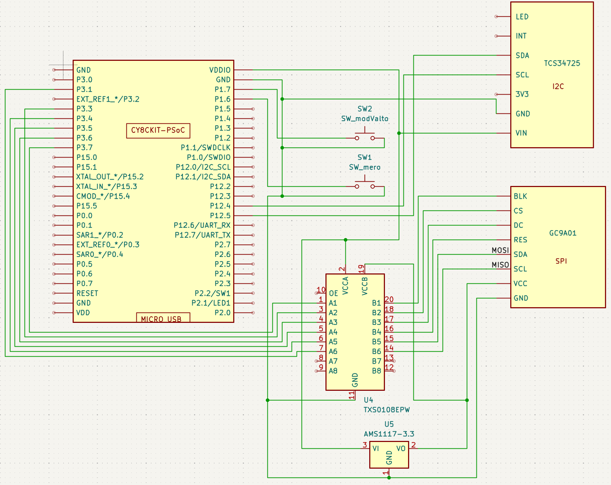
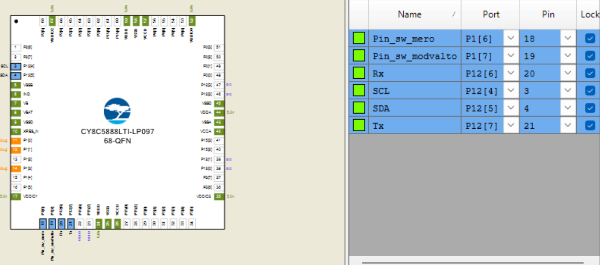
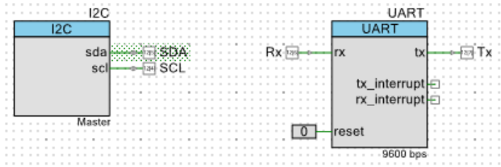
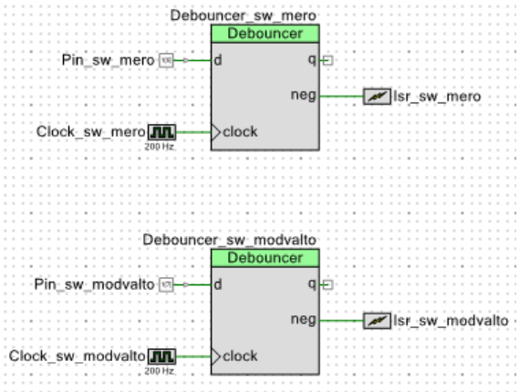

# Color sensor

This is a TCS34725 color sensor driver and small program for CY8C5888LTI-LP097 microcontroller.
Only the files written by me are uploaded, those generated with PSoC Creator are not.

## Dependencies

The dependencies handled by PSoC Creator 4.4.

## Demonstration

<video controls src="images/color_sensor_hd.mp4" title="Color_sensor_in_action"></video>

## Pictures

### Schematics

The values read by the sensor only displayed through UART, the SPI display on the schematics below is not connected in the video.

### PSoC Creator pictures

